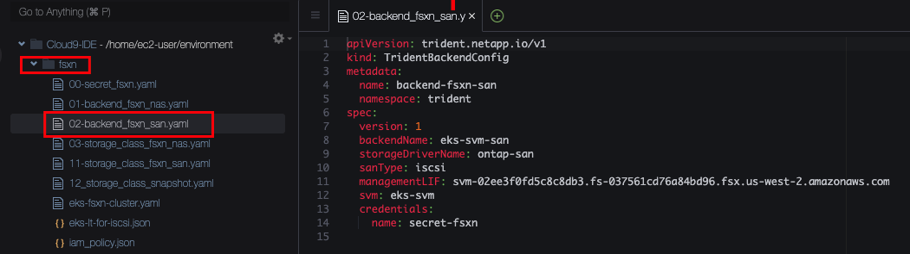
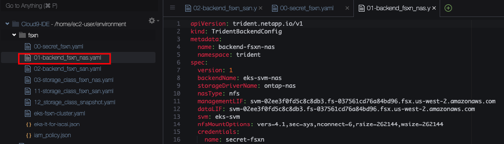
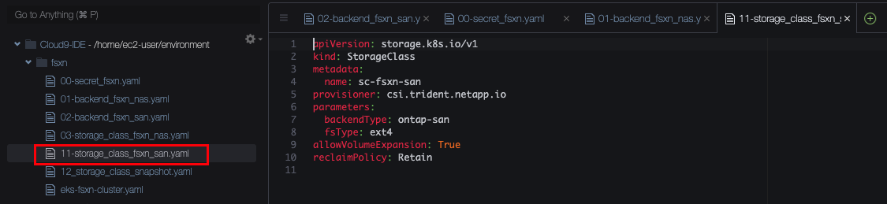

# 3. Configure your storage

## Trident Backend Config for iSCSI

We have prepared configuration manifests for you already. These are generated to match your specific AWS environment with correct networking and credentials. In your Cloud9 Editor, please open the folder `fsxn` on the left navigation bar and then double click the file `02-backend_fsxn_san.yaml`.



This is a `TridentBackendConfig` for iSCSI. Let's review it:

- **Line 4+5** We can assign any name to the Config and we place it in the Trident namespace (where Trident is already installed)
- **Line 9** This is where we need to choose the "driver" that Trident will use. As this is our backend for iSCSI, we choose the block storage ("san") driver, called `ontap-san`
- **Line 10** As Trident (and FSxN) supports multiple protocols for block storage, we need to specify the protocol we intend to use, in this lab we go for iSCSI.
- **Line 11** Trident needs to be able to talk to the API of the FSxN service. FSxN has a management network interface for this purpose. The YAML manifest is already pre-filled with the correct address for your environment. You can verify the interface by running this command in the console:

```console
aws fsx describe-storage-virtual-machines --query "StorageVirtualMachines[*].Endpoints.Management.DNSName"
```

- **Line 12** The FSxN service can be split into multiple sub-tenants called Storage Virtual Machines (SVM). This allows full separation of workloads all the way down to the storage service. In the context of EKS, you can share the same FSxN service between multiple Kubernetes clusters, each cluster having its own SVM. This fully isolates the different clusters from each other while allowing you to manage everything within a single FSxN instance. In the configuration, we specify the name of the SVM that this cluster should use (and the management endpoint above restricts access to this SVM only). We have prepared the configuration with the correct name already, you can verify it by running

```console
aws fsx describe-storage-virtual-machines --query "StorageVirtualMachines[*].Name"
```

- **Line 13+14** Trident needs access credentials to interact with the FSxN API. These credentials are stored as a Kubernetes Secret in the EKS cluster and we reference this Secret here. Credentials can be integrated with AWS IAM but for simplified lab deployment we are using basic username/password here. You can open the file `00-secret_fsxn.yaml` to review the secret being used.

Enough theory, you say? OK, action:

Create the Secret holding the credentials for the Trident backend by running

```console
kubectl apply -f /home/ec2-user/environment/fsxn/00-secret_fsxn.yaml
```

Next, create the Trident backend by running:

```console
kubectl apply -f /home/ec2-user/environment/fsxn/02-backend_fsxn_san.yaml
```

But wait, how do we know if this actually worked? We can check:

```console
kubectl get tbc -n trident
```

You should see that the Status is `Success` and the backend config is `Bound`. It might take a few seconds to reach this state so repeat the command if necessary. But why does it say `Bound`, whereto? Trident performs a series of checks and validations when you create a new backend. if all of them pass it creates a matching `TridentBackend`. You will then have two objects, the `TridentBackendConfig` (or `tbc` for short) and the `TridentBackend` (or `tbe`for short). The only object you should touch is the `TridentBackendConfig`. The backend itself is automatically derived from this by Trident and should not be modified manually. We can check for its existence with

```console
kubectl get tbe -n trident
```

You can also describe the tbc to get a few more details (this is especially useful in case it doesn't work and the state is not `Success`):

```console
kubectl describe tbc backend-fsxn-san -n trident
```

## Trident Backend Config for NFS

Different workloads on your EKS cluster will have different storage needs. While some prefer a block storage, others might need a file storage. In particular, any requirement for a shared storage volume (`ReadWriteMany` or `RWX`in Kubernetes) will need a file based storage solution as block storage does not provide a shared filesystem. The FSxN storage service provide file and block and Trident integrates both into your EKS cluster. All out of a single Trident deployment. All we need is a second `TridentBackendConfig`.

Please open the file `01-backend_fsxn_nas.yaml` so we can review it:



- **Line 9** This time we want the file storage driver, called `ontap-nas` (NAS = Network Attached Storage).
- **Line 10** We select `nfs`as our protocol. Note: Should you ever have a need to run Windows nodes in your Kubernetes cluster, Trident (and FSxN) would support SMB protocol as well.
- **Line 14** For NFS, we can specify the desired mount options.
  - `vers=4.1` selects the NFS version. 4.1 is a good choice as you'll not benefit from additional features in version 4.2 while version 3 would require you to open up more network ports.
  - `sec=sys` sets system security
  - `nconnect=6` instructs NFS to open 6 parallel connections, allowing for much faster storage access.
  - `rsize` and `wsize`configure larger window sizes than default, again giving you better performance

You are a Pro in this by now, so let's create this backend and then verify it:

```console
kubectl apply -f /home/ec2-user/environment/fsxn/01-backend_fsxn_nas.yaml
```

```console
kubectl get tbc,tbe -n trident
```

Remember it might take a few seconds for the validation checks to complete so complete the last command if necessary. Both Backends should now be in state `Bound - Success`.

## Configure Storage Classes

Trident has been configured, but in order to make the new storage options availabe to Kubernetes we also need storage classes.

Let's start with our iSCSI block storage. Please open the file `11-storage_class_san.yaml`



- **Line 4** We give this class a name. This will later be used to provision new volumes (via `PersistentVolumeClaims`) on this particular storage class.
- **Line 5** This storage class will be handled by Trident. EKS will send any storage request against this class to Trident.
- **Line 7** We reference the type of Trident backend that this storage class should use. As this is our san/iscsi storage class, we bind it to any backend that uses the `ontap-san` driver. (Note that more advanced selection criteria a possible but usually not required)
- **Line 9** We want to be able to extend (grow) volumes if needed.
- **Line 10** The `reclaimPolicy`allows to control what should happen if a PVC is deleted. With `Retain` the underlying storage (and the `PersistentVolume` object in EKS) will be kept. Note that you will need a cleanup process (by patching the PV to `Delete`policy). If you are fine with immediate cleanup, you can set this policy to `Delete` instead.

We apply this storage class by running

```console
kubectl apply -f /home/ec2-user/environment/fsxn/11-storage_class_fsxn_san.yaml
```

Now open and review the file `03-storage_class_nas.yaml`. Then apply it with

```console
kubectl apply -f /home/ec2-user/environment/fsxn/03-storage_class_fsxn_nas.yaml
```

We now have three storage classes, the EBS GP2 class and the block and file classes for FSxN:

```console
kubectl get sc
```

If you want to dive into the whole concept of StorageClasses, this is well documented here: https://kubernetes.io/docs/concepts/storage/storage-classes/

Last but not least, we should also create a `VolumeSnapshotClass`. This is much like a `StorageClass`but for Snapshots. It informs EKS that there is a CSI driver that can handle Snapshots. Only one Snapshot class is needed, it applies to all PVCs created by Trident. Open and review the file `12-storage_class_snapshot.yaml`. Then apply it with

```console
kubectl apply -f /home/ec2-user/environment/fsxn/12_storage_class_snapshot.yaml
```

## Configure EBS CSI Driver

While the EBS CSI driver is already configured and has a storage class, it does not yet have a VolumeSnapshotClass. As we want to work with snapshots later on, we create this as well. Open the file `labguide/configure-storage/ebs-snapclass.yaml` in your Cloud9 editor and review it. Then apply it with

```console
cd /home/ec2-user/environment/workshop-files/labguide/configure-your-storage
kubectl apply -f ebs-snapclass.yaml
```

We can review the Snapshot Classes, just to make sure we are ready for the next chapter:

```console
kubectl get volumesnapshotclass
```

This should give you the two classes that we just created, one for EBS and one for FSxN.

If you are ready, move to the next chapter, where will provision our application (and some storage, of course). [4. Provision app and storage](provisoning-demoapp)
