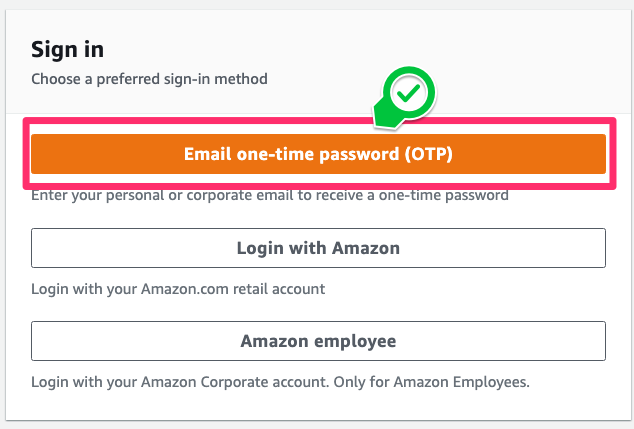
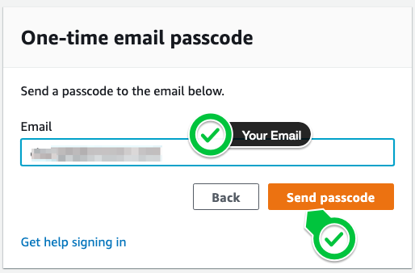
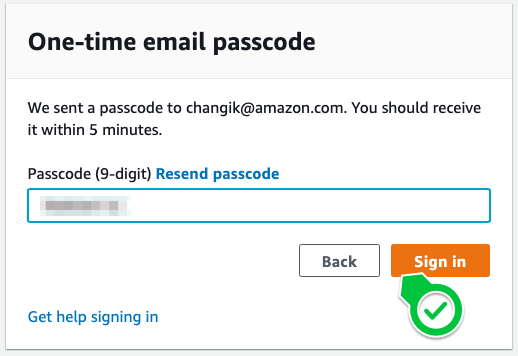
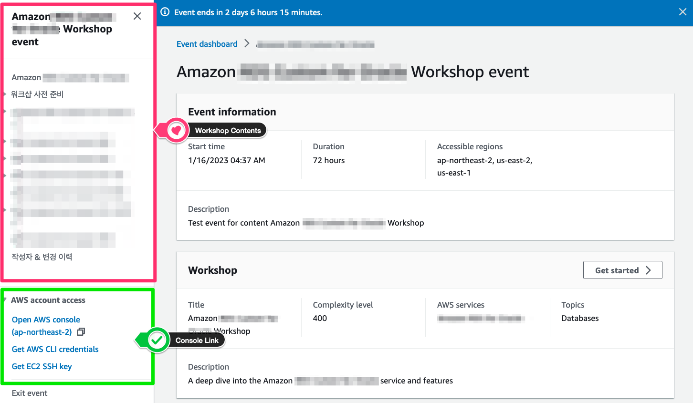
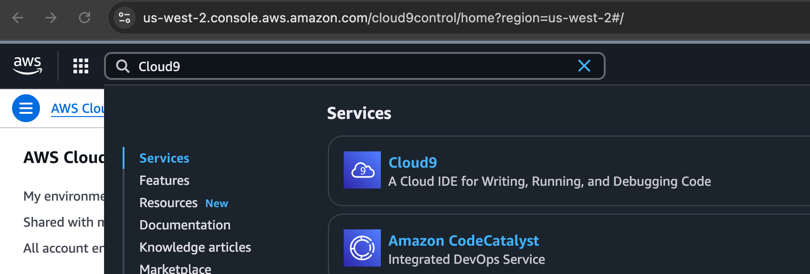
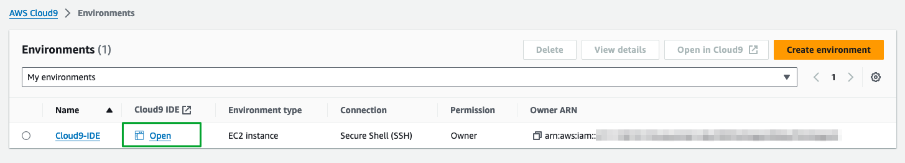
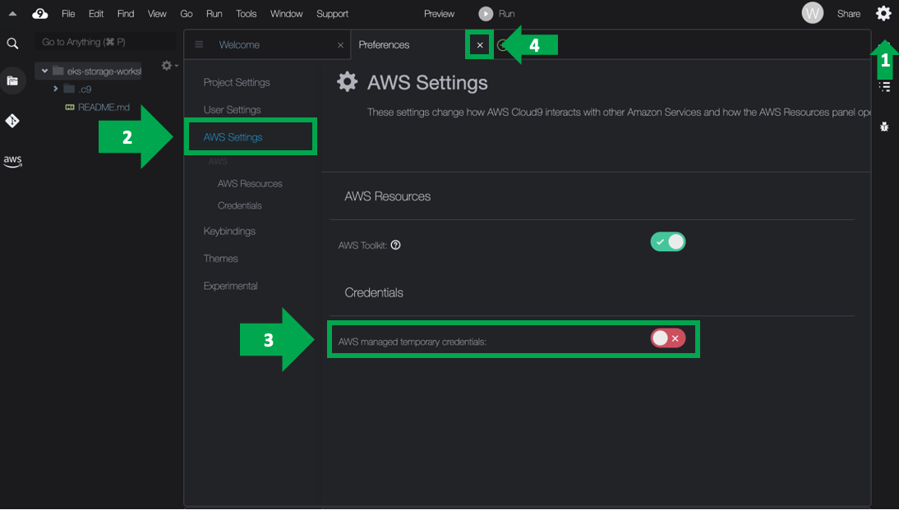

# 1. Get started with your Lab

## Access the lab environment

Access the website address provided by the URL/QR code shown in the workshop.

Click the Email One-Time Password (OTP) button.



Enter your available email address and click the Send passcode button.



Check your email inbox for an email with the subject Your one-time passcode and copy the passcode. Paste the copied passcode as shown below, then click the Sign in button.



The screen will change to the Review and Join screen for the Workshop Studio event terms. After carefully reading the user terms, check `I agree` and click the Join Event button.

You have now transitioned to the workshop screen. The menu in the upper left contains the workshop content, and you can access the AWS Console window by clicking the link in AWS account access at the bottom left. You can also check the Access Key and Secret Access Key for the CLI environment.



## Cloud9

The workshop is primarily conducted in AWS Cloud9 . AWS Cloud9 provides an environment where you can store project files and develop and run various container applications. This IDE supports multiple programming languages and includes a powerful code editing feature set, including a runtime debugger and an integrated terminal. It provides a comprehensive set of tools for coding, building, running, testing, and debugging, and supports the process of deploying software to the cloud.

The Cloud9 setup requires a few more configurations for this lab.

Within the AWS Console, type `Cloud9` at the search bar on top. Choose the Cloud9 service.



Then use the `Open` link to launch your Cloud9 console:





Within Cloud9, you need to modify one setting.
Click on the green + icon and choose "Open Preferences". Then choose "AWS Settings" in the left navigation bar and disable the "AWS managed temporary credentials" option:


## Pre-Script to setup lab

In order to save time, the basic setup of the EKS cluster and storage resources is automated. You just need to run the script by copying the command below into the terminal at the bottom of your Cloud9 window

```bash
curl -sL https://raw.githubusercontent.com/brewery-ninjas/aws-cd2025-munich/refs/heads/main/workshop-environment/prep_environment.sh | bash
```

The setup will take 15-20 minutes so join us on a brief journey of the theory behind the next steps in your lab.

Once the setup script is completed and we finished the overview, you can continue to chapter [2. Explore your lab setup](explore)
